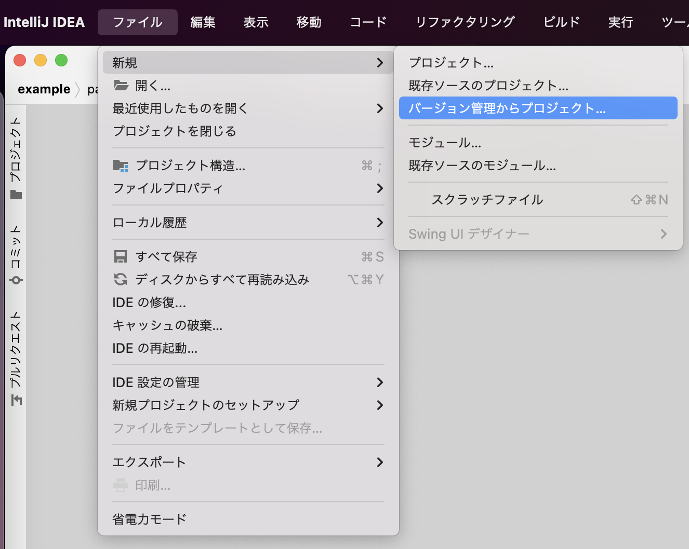
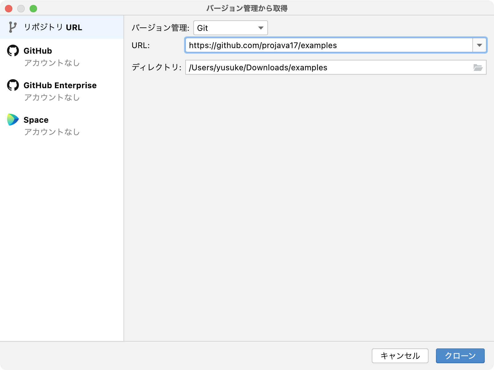
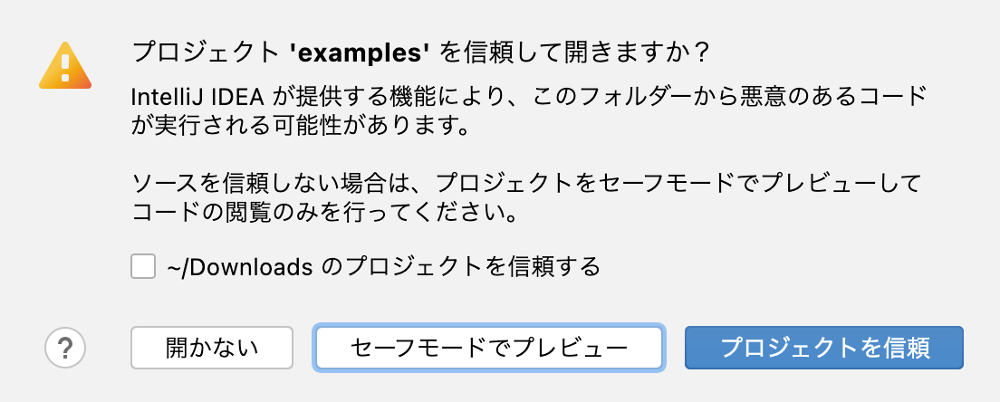
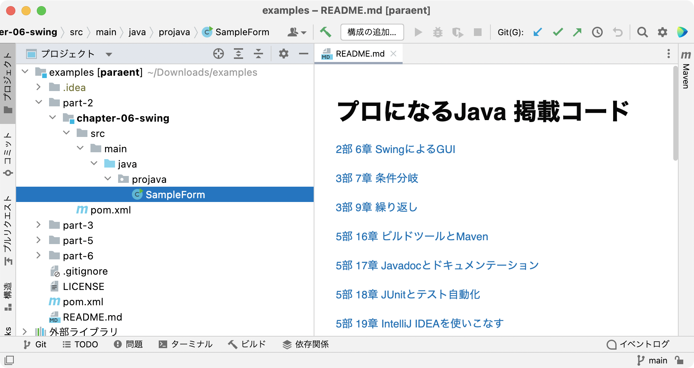

# プロになるJava 

技術評論社の書籍、[『プロになるJava ―仕事で必要なプログラミングの知識がゼロから身につく最高の指南書』](https://gihyo.jp/book/2022/978-4-297-12685-8) 掲載コードです。

ハッシュタグ [&#35;projava](https://twitter.com/search?q=%23projava&src=typed_query&f=live)

## 掲載コード

[2部 6章 SwingによるGUI](./part-2/chapter-06-swing)

[3部 7章 条件分岐](./part-3/chapter-07-condition)

[3部 9章 繰り返し](./part-3/chapter-09-loop)

[5部 16章 ビルドツールとMaven](./part-5/chapter-16-build-tool)

[5部 17章 Javadocとドキュメンテーション](./part-5/chapter-17-javadoc)

[5部 18章 JUnitとテスト自動化](./part-5/chapter-18-junit)

[5部 19章 IntelliJ IDEAを使いこなす](./part-5/chapter-19-ide)

[6部 21章 バージョン管理とGit](./part-6/chapter-21-spring-boot)

## 掲載コードのライセンス

[CC0 1.0 Universal](/LICENSE)

## IntelliJ IDEAを使った掲載コードの開き方

1. ダイアログを開く

[ファイル(File) → 新規(New) → バージョン管理からプロジェクト(Project from Version Control)…] を選択

2. URLを入力

[バージョン管理から取得(Get from Version Control)]ダイアログの[リポジトリURL(Repository URL)] → [URL:]欄に https://github.com/projava17/examples を入力し、[クローン(Clone)]を押す

3. プロジェクト信頼の設定

「プロジェクト 'examples' を信頼して開きますか？(Trust and Open Project 'examples'?)」というダイアログが表示されるので、[プロジェクトを信頼(Trust Project)]を押して開く。

4. IDEウインドウを確認

部毎、章毎にディレクトリが分けられていますのでご確認ください。

## リンク

### 技術評論社

[技術評論社](https://gihyo.jp/)

### きしだ なおき

[Amazon.co.jp: きしだなおき: 作品一覧、著者略歴](https://www.amazon.co.jp/きしだ-なおき/e/B09VPTG6KR?ref_=dbs_p_pbk_r00_abau_000000)

[きしだのHatena(ブログ)](https://nowokay.hatenablog.com)

### 山本 裕介

[Amazon.co.jp: 山本裕介: 作品一覧、著者略歴](https://www.amazon.co.jp/山本%E3%80%80裕介/e/B0057FTY5K?ref_=dbs_p_pbk_r00_abau_000000)

[yusuke.blog(ブログ)](https://yusuke.blog)

### 杉山 貴章

